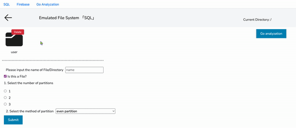

# 📝 Emulated File System

## Demo gif:

## Table of Content:

- [About The App](#about-the-app)
- [Technologies](#technologies)
- [Setup](#setup)

## 🧐 About The App
This project is developing and utilizing an emulation-based system for distributed file storage and parallel computation, in this project, we designed EDFS Api to realize file system operations such as mkdir/ls/cat/rm etc. We used two database(mySQL-based emulation and Firebase-based emulation) to represent the hierachy of file, we also built an web app for the interface of file system.

## 🚀 Technologies
We used `Django` for backend and `React` for frontend

## ⚙️ Setup

Firstly, download django 3.3.0 and node v16.18.0

### To run frontend:

#### `cd frontend`
Open the frontend directory

#### `npm install`
install module for frontend

#### `npm start`

Runs the app in the development mode.\
Open [http://localhost:3000](http://localhost:3000) to view it in your browser.

The page will reload when you make changes.\
You may also see any lint errors in the console.

### To run backend:
#### `cd backend`
Open the backend directory

#### `python3 manage.py runserver`
Starting development server at http://127.0.0.1:8000/
